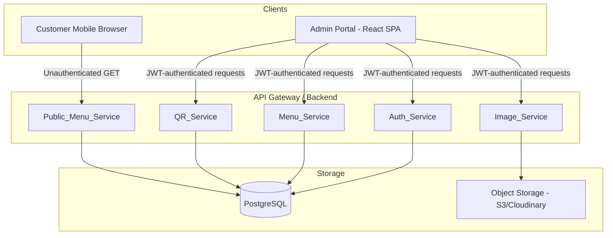

# Design Document: Digital Menu QR System

## Overview

The Digital Menu QR System is a multi-tenant SaaS platform where restaurant owners manage digital menus accessible via QR codes. The system has three distinct user roles:

- **Super Admin**: Platform-level management (user accounts, system oversight)
- **Owner**: Restaurant profile and menu management
- **Customer**: Read-only public menu access via QR code scan

The architecture follows a service-oriented backend with a React-based frontend. All Owner/Admin interactions go through authenticated REST APIs. Customer-facing menu access is unauthenticated and optimized for mobile browsers.

---

## Architecture



**Key architectural decisions:**

- Single deployable Node.js/Express backend with logically separated service modules (not microservices), keeping operational complexity low for a SaaS MVP.
- PostgreSQL for relational data with foreign key constraints enforcing tenant isolation.
- JWT-based stateless auth; session invalidation on deactivation handled via a token blocklist or short-lived tokens + refresh token revocation table.
- Rate limiting on the public endpoint via an in-process middleware (e.g., `express-rate-limit`) backed by Redis for multi-instance deployments.

---

## Components and Interfaces

### Auth_Service

Handles registration, login, and token validation.

| Endpoint | Method | Auth | Description |
|---|---|---|---|
| `/api/auth/login` | POST | None | Returns JWT + role on valid credentials |
| `/api/auth/register` | POST | Super_Admin JWT | Creates a new Owner account |
| `/api/auth/users` | GET | Super_Admin JWT | Lists all Owner accounts |
| `/api/auth/users/:id/deactivate` | PATCH | Super_Admin JWT | Deactivates an Owner account |

JWT payload shape:
```json
{ "sub": "<user_id>", "role": "super_admin | owner", "iat": 0, "exp": 0 }
```

### Menu_Service

Handles CRUD for Categories and Menu Items. All endpoints require Owner JWT. Ownership is validated before every write.

| Endpoint | Method | Description |
|---|---|---|
| `/api/categories` | POST | Create category |
| `/api/categories/:id` | PATCH | Update category |
| `/api/categories/:id` | DELETE | Delete category + cascade items |
| `/api/restaurants/:id/categories` | GET | List categories (sorted by display_order) |
| `/api/items` | POST | Create menu item |
| `/api/items/:id` | PATCH | Update menu item |
| `/api/items/:id` | DELETE | Delete menu item |

### QR_Service

| Endpoint | Method | Auth | Description |
|---|---|---|---|
| `/api/restaurant/qr` | GET | Owner JWT | Generate/return QR PNG for the owner's restaurant |

### Public_Menu_Service

| Endpoint | Method | Auth | Description |
|---|---|---|---|
| `/api/public/menu/:unique_qr_id` | GET | None | Return full menu data for a restaurant |

Rate limited: 100 req/min per IP.

### Image_Service

| Endpoint | Method | Auth | Description |
|---|---|---|---|
| `/api/images/upload` | POST | Owner JWT | Upload image; returns permanent URL |

Validates MIME type via binary magic bytes (not file extension). Accepts JPEG, PNG, WebP up to 5 MB.

---

## Data Models

### users

```sql
CREATE TABLE users (
  id          UUID PRIMARY KEY DEFAULT gen_random_uuid(),
  email       TEXT UNIQUE NOT NULL,
  password_hash TEXT NOT NULL,          -- bcrypt, cost >= 12
  role        TEXT NOT NULL CHECK (role IN ('super_admin', 'owner')),
  status      TEXT NOT NULL DEFAULT 'active' CHECK (status IN ('active', 'inactive')),
  created_at  TIMESTAMPTZ NOT NULL DEFAULT now()
);
```

### restaurants

```sql
CREATE TABLE restaurants (
  id            UUID PRIMARY KEY DEFAULT gen_random_uuid(),
  owner_id      UUID NOT NULL REFERENCES users(id),
  name          TEXT NOT NULL,
  address       TEXT,
  logo_url      TEXT,
  primary_color TEXT,
  slug          TEXT UNIQUE NOT NULL,
  unique_qr_id  TEXT UNIQUE NOT NULL DEFAULT gen_random_uuid(),
  created_at    TIMESTAMPTZ NOT NULL DEFAULT now()
);
```

### categories

```sql
CREATE TABLE categories (
  id            UUID PRIMARY KEY DEFAULT gen_random_uuid(),
  restaurant_id UUID NOT NULL REFERENCES restaurants(id) ON DELETE CASCADE,
  name          TEXT NOT NULL,
  display_order INT NOT NULL DEFAULT 0,
  created_at    TIMESTAMPTZ NOT NULL DEFAULT now(),
  UNIQUE (restaurant_id, name)
);
```

### menu_items

```sql
CREATE TABLE menu_items (
  id            UUID PRIMARY KEY DEFAULT gen_random_uuid(),
  category_id   UUID NOT NULL REFERENCES categories(id) ON DELETE CASCADE,
  name          TEXT NOT NULL,
  description   TEXT,
  price         NUMERIC(10,2) NOT NULL CHECK (price >= 0),
  image_url     TEXT,
  is_available  BOOLEAN NOT NULL DEFAULT true,
  display_order INT NOT NULL DEFAULT 0,
  created_at    TIMESTAMPTZ NOT NULL DEFAULT now()
);
```

### revoked_tokens (for session invalidation on deactivation)

```sql
CREATE TABLE revoked_tokens (
  jti        TEXT PRIMARY KEY,
  revoked_at TIMESTAMPTZ NOT NULL DEFAULT now(),
  expires_at TIMESTAMPTZ NOT NULL
);
```

---

## Correctness Properties

*A property is a characteristic or behavior that should hold true across all valid executions of a system — essentially, a formal statement about what the system should do. Properties serve as the bridge between human-readable specifications and machine-verifiable correctness guarantees.*

### Property 1: Valid login returns JWT with correct role

*For any* user record with a known email and correct password, submitting those credentials to `/api/auth/login` should return a JWT whose decoded payload contains the same role as stored in the database.

**Validates: Requirements 1.1**

---

### Property 2: Invalid credentials always rejected

*For any* combination of email and password where at least one does not match a stored user record, the login endpoint should return HTTP 401.

**Validates: Requirements 1.2**

---

### Property 3: Inactive owner login rejected

*For any* Owner account whose status is `inactive`, a login attempt should always return HTTP 403 regardless of whether the password is correct.

**Validates: Requirements 2.5**

---

### Property 4: Duplicate email registration rejected

*For any* email address that already exists in the `users` table, a Super_Admin registration request using that email should return HTTP 409.

**Validates: Requirements 2.2**

---

### Property 5: Ownership isolation — 403 on cross-tenant access

*For any* authenticated Owner and any resource (Restaurant, Category, or Menu_Item) not belonging to that Owner's account, every read and write request targeting that resource should return HTTP 403 without leaking data.

**Validates: Requirements 3.4, 4.5, 5.6, 10.1, 10.2**

---

### Property 6: Category sort order invariant

*For any* restaurant with any number of categories, the list returned by the Menu_Service should always be sorted in ascending order by `display_order`.

**Validates: Requirements 4.4**

---

### Property 7: Category cascade delete

*For any* category that is deleted, all menu items belonging to that category should also be absent from subsequent queries.

**Validates: Requirements 4.3**

---

### Property 8: Duplicate category name within restaurant rejected

*For any* restaurant, attempting to create a second category with the same name as an existing category in that restaurant should return HTTP 409.

**Validates: Requirements 4.6**

---

### Property 9: Menu item sort order invariant

*For any* category with any number of menu items, the list returned by the Menu_Service should always be sorted in ascending order by `display_order`.

**Validates: Requirements 5.5**

---

### Property 10: Negative price rejected

*For any* menu item creation or update request where the submitted price is less than 0, the Menu_Service should return HTTP 422.

**Validates: Requirements 5.7**

---

### Property 11: QR code URL stability

*For any* restaurant with an existing `unique_qr_id`, repeated calls to `GET /api/restaurant/qr` should always produce a QR code image that encodes the same URL containing that same `unique_qr_id`.

**Validates: Requirements 6.3**

---

### Property 12: Public menu response completeness

*For any* valid `unique_qr_id`, the public menu response should include the restaurant name, logo URL, primary color, and all categories with their menu items, each containing name, description, price, image URL, and `is_available` status.

**Validates: Requirements 7.1, 7.2**

---

### Property 13: Public menu sort order

*For any* valid `unique_qr_id`, the public menu response should have categories sorted ascending by `display_order` and menu items within each category sorted ascending by `display_order`.

**Validates: Requirements 7.5**

---

### Property 14: Unknown QR ID returns 404

*For any* string that does not correspond to a `unique_qr_id` in the database, a request to `GET /api/public/menu/{id}` should return HTTP 404.

**Validates: Requirements 7.4**

---

### Property 15: Image MIME validation rejects non-permitted types

*For any* uploaded file whose binary magic bytes do not correspond to JPEG, PNG, or WebP, the Image_Service should return HTTP 422 regardless of the file's extension or declared content-type.

**Validates: Requirements 9.2, 9.3**

---

### Property 16: Image size limit enforced

*For any* uploaded file exceeding 5 MB in size, the Image_Service should return HTTP 413.

**Validates: Requirements 9.4**

---

### Property 17: Partial update preserves unchanged fields

*For any* restaurant or menu item, submitting a PATCH request with a subset of fields should leave all non-submitted fields unchanged in the database.

**Validates: Requirements 3.3, 5.2**

---

## Error Handling

| Scenario | HTTP Status | Notes |
|---|---|---|
| Invalid credentials | 401 | Generic message to avoid user enumeration |
| Expired/invalid JWT | 401 | |
| Inactive account login | 403 | |
| Insufficient role | 403 | |
| Cross-tenant resource access | 403 | No data leakage |
| Duplicate email on register | 409 | |
| Duplicate category name | 409 | |
| Negative price | 422 | |
| Invalid image format | 422 | |
| Image too large | 413 | |
| Unknown `unique_qr_id` | 404 | |
| Rate limit exceeded | 429 | `Retry-After` header included |

All error responses follow a consistent JSON envelope:
```json
{ "error": { "code": "INVALID_CREDENTIALS", "message": "..." } }
```

---

## Testing Strategy

### Dual Testing Approach

Both unit tests and property-based tests are required. They are complementary:

- **Unit tests** cover specific examples, integration points, and error conditions.
- **Property-based tests** verify universal properties across randomly generated inputs, catching edge cases that hand-written examples miss.

### Unit Testing

Framework: **Jest** (Node.js backend), **React Testing Library** (frontend).

Focus areas:
- Auth middleware correctly parses and rejects JWTs
- Ownership guard middleware returns 403 for mismatched owner_id
- Image MIME detection logic for each permitted and rejected type
- QR code generation produces a valid PNG buffer
- Public menu endpoint returns correct shape for a known fixture

### Property-Based Testing

Framework: **fast-check** (JavaScript/TypeScript).

Each property test must run a minimum of **100 iterations**.

Each test must include a comment tag in the format:
`// Feature: digital-menu-qr-system, Property <N>: <property_text>`

| Property | Test Description |
|---|---|
| P1 | For any valid user, login returns JWT with matching role |
| P2 | For any invalid credential pair, login returns 401 |
| P3 | For any inactive owner, login returns 403 |
| P4 | For any duplicate email, register returns 409 |
| P5 | For any cross-tenant resource reference, response is 403 |
| P6 | For any category list, result is sorted ascending by display_order |
| P7 | For any deleted category, its items are absent from subsequent queries |
| P8 | For any duplicate category name in same restaurant, returns 409 |
| P9 | For any item list in a category, result is sorted ascending by display_order |
| P10 | For any price < 0, item creation/update returns 422 |
| P11 | For any restaurant, repeated QR generation encodes the same URL |
| P12 | For any valid unique_qr_id, public response contains all required fields |
| P13 | For any valid unique_qr_id, public response is correctly sorted |
| P14 | For any unknown unique_qr_id, public endpoint returns 404 |
| P15 | For any non-permitted MIME binary, image upload returns 422 |
| P16 | For any file > 5 MB, image upload returns 413 |
| P17 | For any PATCH with subset of fields, non-submitted fields are unchanged |

### Integration Testing

- End-to-end flow: Owner registers → creates restaurant → adds categories/items → generates QR → customer scans and views menu
- Session invalidation: Owner deactivated by Super_Admin → subsequent requests with old JWT are rejected
- Rate limiting: Burst of 101 requests to public endpoint from same IP → 101st returns 429
